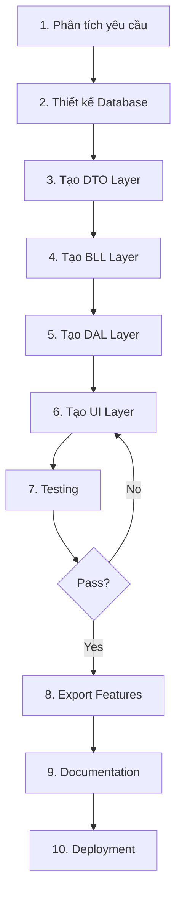

# HƯỚNG DẪN TOÀN DIỆN: PHÁT TRIỂN HỆ THỐNG QUẢN LÝ TRƯỜNG ĐẠI HỌC

> **📚 Dành cho:** Sinh viên học lực trung bình - khá muốn cải thiện kỹ năng lập trình
>
> **🎯 Mục tiêu:** Xây dựng hệ thống quản lý hoàn chỉnh với kiến trúc N-Layer, không sử dụng thư viện bên ngoài
>
> **⏱️ Thời gian:** 4-6 tuần (tùy năng lực)

---

## 📖 MỤC LỤC

1. [Tổng quan kiến trúc hệ thống](#1-tổng-quan-kiến-trúc-hệ-thống)
2. [Quy trình phát triển (Workflow)](#2-quy-trình-phát-triển-workflow)
3. [Use Cases chi tiết](#3-use-cases-chi-tiết)
4. [ERD - Thiết kế cơ sở dữ liệu](#4-erd---thiết-kế-cơ-sở-dữ-liệu)
5. [UML Class Diagram](#5-uml-class-diagram)
6. [Hướng dẫn từng bước](#6-hướng-dẫn-từng-bước)
7. [Patterns và Best Practices](#7-patterns-và-best-practices)
8. [Gợi ý tối ưu và nâng cao](#8-gợi-ý-tối-ưu-và-nâng-cao)
9. [Checklist hoàn thành](#9-checklist-hoàn-thành)

---

## 1. TỔNG QUAN KIẾN TRÚC HỆ THỐNG

### 1.1. Kiến trúc N-Layer (3-Tier Architecture)

```
┌─────────────────────────────────────────────────────────────────┐
│                    PRESENTATION LAYER (UI)                      │
│  ┌──────────────┐  ┌──────────────┐  ┌──────────────┐          │
│  │ FormQuanLy   │  │ FormXetTot   │  │ FormXetThi   │          │
│  │ SinhVien     │  │ Nghiep       │  │ Dua          │  ...     │
│  └──────────────┘  └──────────────┘  └──────────────┘          │
│         │                  │                  │                  │
└─────────┼──────────────────┼──────────────────┼──────────────────┘
          │                  │                  │
          ↓                  ↓                  ↓
┌─────────────────────────────────────────────────────────────────┐
│              BUSINESS LOGIC LAYER (BLL)                         │
│  ┌──────────────┐  ┌──────────────┐  ┌──────────────┐          │
│  │ ChucNangThem │  │ ChucNangXoa  │  │ ChucNangSua  │          │
│  │ ThongTin...  │  │ ThongTin...  │  │ ThongTin...  │          │
│  └──────────────┘  └──────────────┘  └──────────────┘          │
│  ┌──────────────┐  ┌──────────────┐  ┌──────────────┐          │
│  │ ChucNangTim  │  │ ChucNangSap  │  │ ChucNangThong│          │
│  │ Kiem...      │  │ Xep...       │  │ Ke...        │          │
│  └──────────────┘  └──────────────┘  └──────────────┘          │
│  ┌──────────────────────────────────────────────────┐          │
│  │         Export Layer (CSV, RTF, Chart)           │          │
│  └──────────────────────────────────────────────────┘          │
│         │                  │                  │                  │
└─────────┼──────────────────┼──────────────────┼──────────────────┘
          │                  │                  │
          ↓                  ↓                  ↓
┌─────────────────────────────────────────────────────────────────┐
│           DATA TRANSFER OBJECT LAYER (DTO)                      │
│  ┌──────────────┐  ┌──────────────┐  ┌──────────────┐          │
│  │ ThongTinSinh │  │ ThongTinXet  │  │ ThongTinXet  │          │
│  │ Vien         │  │ TotNghiep    │  │ ThiDua       │  ...     │
│  └──────────────┘  └──────────────┘  └──────────────┘          │
│  ┌──────────────┐  ┌──────────────┐  ┌──────────────┐          │
│  │ QuanLySinh   │  │ QuanLyXet    │  │ QuanLyXet    │          │
│  │ Vien         │  │ TotNghiep    │  │ ThiDua       │  ...     │
│  └──────────────┘  └──────────────┘  └──────────────┘          │
│         │                  │                  │                  │
└─────────┼──────────────────┼──────────────────┼──────────────────┘
          │                  │                  │
          ↓                  ↓                  ↓
┌─────────────────────────────────────────────────────────────────┐
│              DATA ACCESS LAYER (DAL)                            │
│  ┌──────────────┐  ┌──────────────┐  ┌──────────────┐          │
│  │ ThemDuLieu   │  │ XoaDuLieu    │  │ SuaDuLieu    │          │
│  │ ...          │  │ ...          │  │ ...          │          │
│  └──────────────┘  └──────────────┘  └──────────────┘          │
│  ┌──────────────┐  ┌──────────────┐                            │
│  │ TimKiemDu    │  │ LayTatCaDu   │                            │
│  │ Lieu...      │  │ Lieu...      │                            │
│  └──────────────┘  └──────────────┘                            │
│         │                  │                                     │
└─────────┼──────────────────┼─────────────────────────────────────┘
          │                  │
          ↓                  ↓
┌─────────────────────────────────────────────────────────────────┐
│                   SQL SERVER DATABASE                           │
│  ┌──────────────────────────────────────────────────┐          │
│  │  Tables: ThongTinSinhVien, ThongTinGiangVien,   │          │
│  │  ThongTinMonHoc, ThongTinLopHoc, ThongTinDiem,  │          │
│  │  ThongTinHoSo, ThongTinDaoTao, ThongTinXetTot   │          │
│  │  Nghiep, ThongTinXetThiDua                      │          │
│  └──────────────────────────────────────────────────┘          │
└─────────────────────────────────────────────────────────────────┘
```

### 1.2. Lợi ích của kiến trúc N-Layer

| Lợi ích | Giải thích | Ví dụ thực tế |
|---------|------------|---------------|
| **Separation of Concerns** | Mỗi layer có trách nhiệm riêng biệt | UI chỉ lo hiển thị, BLL lo logic, DAL lo database |
| **Maintainability** | Dễ bảo trì, sửa lỗi | Thay đổi UI không ảnh hưởng BLL |
| **Testability** | Test từng layer độc lập | Unit test BLL mà không cần database |
| **Reusability** | BLL có thể dùng cho nhiều UI | WinForms, WPF, Web API dùng chung BLL |
| **Scalability** | Dễ nâng cấp từng phần | Chuyển từ in-memory sang SQL Server |

---

## 2. QUY TRÌNH PHÁT TRIỂN (WORKFLOW)

### 2.1. Workflow tổng quan



### 2.2. Chi tiết từng bước

#### **BƯỚC 1: Phân tích yêu cầu (1-2 ngày)**

**Input:**
- Mô tả bài toán
- Yêu cầu chức năng
- Danh sách actors (người dùng)

**Output:**
- Danh sách Use Cases
- Danh sách entities (đối tượng)
- Danh sách chức năng

**Ví dụ:**
```
Module: Quản lý sinh viên
Actors: Admin, Giảng viên, Sinh viên
Use Cases:
  1. Thêm sinh viên mới
  2. Xóa sinh viên
  3. Sửa thông tin sinh viên
  4. Tìm kiếm sinh viên
  5. Xuất danh sách ra Excel
  6. Xem báo cáo thống kê
```

#### **BƯỚC 2: Thiết kế Database (2-3 ngày)**

**Công việc:**
1. Xác định các bảng (tables)
2. Xác định các cột (columns) và kiểu dữ liệu
3. Xác định Primary Key, Foreign Key
4. Xác định relationships (1-1, 1-N, N-N)
5. Vẽ ERD diagram

**Công cụ:**
- Draw.io
- dbdiagram.io
- SQL Server Management Studio

**Kết quả:**
- File .sql tạo database
- ERD diagram (hình ảnh)

#### **BƯỚC 3: Tạo DTO Layer (1 ngày)**

**Mẫu code:**
```csharp
// File: ThongTinSinhVien.cs
public class ThongTinSinhVien
{
    public int ID { get; set; }
    public string MaSinhVien { get; set; } = "";
    public string HoTen { get; set; } = "";
    public DateTime NgaySinh { get; set; }
    public string GioiTinh { get; set; } = "";
    public string Khoa { get; set; } = "";
    // ... các properties khác
}

// File: QuanLySinhVien.cs
public class QuanLySinhVien
{
    private List<ThongTinSinhVien> danhSachSinhVien;

    public QuanLySinhVien()
    {
        danhSachSinhVien = new List<ThongTinSinhVien>();
    }

    public List<ThongTinSinhVien> LayDanhSachSinhVien()
    {
        return danhSachSinhVien;
    }
}
```

**Lưu ý:**
- Đặt tên property theo PascalCase
- Sử dụng auto-properties
- Khởi tạo giá trị mặc định cho string = ""

#### **BƯỚC 4: Tạo BLL Layer (3-4 ngày)**

**6 file chuẩn cho mỗi module:**

1. **ThemThongTin[Entity].cs**
   ```csharp
   public bool ThemSinhVien(List<ThongTinSinhVien> danhSach, ThongTinSinhVien svMoi)
   {
       // 1. Validate input
       if (svMoi == null || string.IsNullOrEmpty(svMoi.MaSinhVien))
           return false;

       // 2. Kiểm tra trùng lặp
       foreach (ThongTinSinhVien sv in danhSach)
       {
           if (sv.MaSinhVien == svMoi.MaSinhVien)
               return false;
       }

       // 3. Thêm vào danh sách
       danhSach.Add(svMoi);
       return true;
   }
   ```

2. **XoaThongTin[Entity].cs**
3. **SuaThongTin[Entity].cs**
4. **TimKiemThongTin[Entity].cs**
5. **SapXepThongTin[Entity].cs**
6. **ThongKeThongTin[Entity].cs**

**Algorithms thường dùng:**
- **Sequential Search**: O(n) - Tìm kiếm tuần tự
- **Bubble Sort**: O(n²) - Sắp xếp nổi bọt
- **Count with Dictionary**: O(n) - Thống kê

#### **BƯỚC 5: Tạo DAL Layer (2 ngày)**

**Template code:**
```csharp
public class ChucNangThemDuLieuSinhVien
{
    // TODO: Khi có database, uncomment code này
    /*
    public bool ThemSinhVienVaoDatabase(ThongTinSinhVien sv)
    {
        string connectionString = "...";
        using (SqlConnection conn = new SqlConnection(connectionString))
        {
            conn.Open();
            string sql = "INSERT INTO ThongTinSinhVien (...) VALUES (...)";
            using (SqlCommand cmd = new SqlCommand(sql, conn))
            {
                cmd.Parameters.AddWithValue("@MaSinhVien", sv.MaSinhVien);
                // ... thêm parameters khác

                int rowsAffected = cmd.ExecuteNonQuery();
                return rowsAffected > 0;
            }
        }
    }
    */
}
```

**Lưu ý:**
- Hiện tại để TODO, sau này implement khi có database
- Giữ cấu trúc giống BLL để dễ migrate

#### **BƯỚC 6: Tạo UI Layer (5-6 ngày)**

**Cấu trúc Form chuẩn:**

```
Form Layout (1400x750px)
┌─────────────────────────────────────────────────────┐
│ [Label] [TextBox]  [ComboBox1]  [ComboBox2]        │ ← Filters (Y=20-100)
├─────────────────────────────────────────────────────┤
│                                                     │
│              DataGridView (1350x500)                │ ← Data (Y=120)
│                                                     │
├─────────────────────────────────────────────────────┤
│ [Thêm] [Xóa] [Sửa] [Tìm] [Làm mới] [Thống kê]     │ ← CRUD (Y=640)
│ [Excel] [Word] [Chart]                              │ ← Export
└─────────────────────────────────────────────────────┘
```

**Code pattern:**
```csharp
public partial class FormQuanLySinhVien : Form
{
    // 1. Private fields
    private QuanLySinhVien quanLy;
    private ChucNangThemThongTinSinhVien chucNangThem;
    private ChucNangXoaThongTinSinhVien chucNangXoa;
    // ... 6 BLL classes

    // 2. Constructor
    public FormQuanLySinhVien()
    {
        InitializeComponent();

        // Khởi tạo objects
        quanLy = new QuanLySinhVien();
        chucNangThem = new ChucNangThemThongTinSinhVien();
        // ...

        // Load data
        LoadDuLieuMau();
        HienThiDanhSach();
    }

    // 3. Display method
    private void HienThiDanhSach() { ... }

    // 4. CRUD Event handlers
    private void BtnThem_Click(object sender, EventArgs e) { ... }
    private void BtnXoa_Click(object sender, EventArgs e) { ... }
    private void BtnSua_Click(object sender, EventArgs e) { ... }

    // 5. Export Event handlers
    private void BtnXuatExcel_Click(object sender, EventArgs e) { ... }
    private void BtnXuatWord_Click(object sender, EventArgs e) { ... }
    private void BtnXuatBieuDo_Click(object sender, EventArgs e) { ... }
}
```

---

## 3. USE CASES CHI TIẾT

### 3.1. UC-01: Quản lý sinh viên

**Actors:** Admin, Giảng viên

**Precondition:** User đã đăng nhập

**Main Flow:**
1. User mở FormQuanLySinhVien
2. System hiển thị danh sách sinh viên trong DataGridView
3. User click button "Thêm"
4. System hiển thị dialog nhập thông tin
5. User nhập đầy đủ thông tin và click "Lưu"
6. System validate dữ liệu
7. System gọi BLL.ThemSinhVien()
8. BLL kiểm tra trùng mã sinh viên
9. BLL thêm vào List<ThongTinSinhVien>
10. System refresh DataGridView
11. System hiển thị thông báo "Thêm thành công"

**Alternative Flow 6a: Dữ liệu không hợp lệ**
- 6a1. System hiển thị thông báo lỗi
- 6a2. Return to step 5

**Alternative Flow 8a: Mã sinh viên đã tồn tại**
- 8a1. System hiển thị "Mã đã tồn tại"
- 8a2. Return to step 5

**Postcondition:** Sinh viên mới được thêm vào hệ thống

### 3.2. UC-02: Xét tốt nghiệp

**Actors:** Admin, Phòng Đào tạo

**Main Flow:**
1. User mở FormQuanLyXetTotNghiep
2. User click "Thêm" để xét sinh viên
3. System hiển thị form nhập thông tin
4. User nhập: MaSV, Tín chỉ, GPA, Điểm rèn luyện, TOEIC, Khóa luận
5. User click "Lưu"
6. System gọi BLL.DanhGiaDieuKienTotNghiep()
7. BLL kiểm tra 6 điều kiện:
   - Tín chỉ >= 120
   - GPA >= 2.0
   - Điểm rèn luyện >= 50
   - Không còn môn nợ
   - TOEIC >= 450
   - Khóa luận hoàn thành
8. BLL tính XepLoaiTotNghiep dựa trên GPA
9. BLL set KetQuaXet (Đủ/Không đủ/Có điều kiện)
10. System lưu kết quả
11. System refresh DataGridView với color-coding

**Business Rules:**
```
IF (tất cả 6 điều kiện đạt) THEN
    KetQuaXet = "Đủ điều kiện"
    IF GPA >= 3.6 THEN XepLoai = "Xuất sắc"
    ELSE IF GPA >= 3.2 THEN XepLoai = "Giỏi"
    ELSE IF GPA >= 2.5 THEN XepLoai = "Khá"
    ELSE XepLoai = "Trung bình"
ELSE IF (chỉ thiếu TOEIC) THEN
    KetQuaXet = "Tốt nghiệp có điều kiện"
ELSE
    KetQuaXet = "Không đủ điều kiện"
END IF
```

### 3.3. UC-03: Xuất báo cáo

**Actors:** Admin, Giảng viên, Phòng Đào tạo

**Main Flow - Xuất Excel:**
1. User click button "Xuất Excel"
2. System hiển thị SaveFileDialog
3. User chọn đường dẫn và tên file
4. System gọi ChucNangXuatCSV.XuatDanhSach()
5. BLL tạo header row với UTF-8 BOM
6. BLL loop qua từng record, escape CSV characters
7. BLL ghi file với Encoding.UTF8
8. System hiển thị thông báo "Xuất thành công"
9. System mở File Explorer tại vị trí file

**Main Flow - Xuất Word:**
1. User click button "Xuất Word"
2. System gọi ChucNangXuatRTF.XuatBaoCao()
3. BLL tạo RTF header với font table
4. BLL tạo RTF table với borders
5. BLL escape Vietnamese characters thành Unicode
6. BLL ghi file .rtf
7. System mở file trong Word

**Main Flow - Xuất Biểu đồ:**
1. User click button "Xuất Biểu đồ"
2. System thu thập dữ liệu thống kê
3. System gọi ChucNangXuatBieuDo.TaoBieuDoCot()
4. BLL tạo HTML structure
5. BLL tạo SVG chart với <rect>, <text>
6. BLL tính toán tọa độ, scale
7. BLL ghi file .html
8. System mở file trong trình duyệt

---

## 4. ERD - THIẾT KẾ CƠ SỞ DỮ LIỆU

### 4.1. ERD Diagram

```
┌─────────────────────────┐
│   ThongTinSinhVien      │
├─────────────────────────┤
│ PK ID (INT)             │
│ UK MaSinhVien (NVARCHAR)│
│    HoTen (NVARCHAR)     │
│    NgaySinh (DATE)      │
│    GioiTinh (NVARCHAR)  │
│    Khoa (NVARCHAR)      │
│    Nganh (NVARCHAR)     │
│    KhoaHoc (NVARCHAR)   │
│    Email (NVARCHAR)     │
│    SoDienThoai (NVARCHAR)│
└─────────────────────────┘
           │ 1
           │
           │ N
           ↓
┌─────────────────────────┐       ┌─────────────────────────┐
│   ThongTinDiem          │   N   │   ThongTinMonHoc        │
├─────────────────────────┤ ────→ ├─────────────────────────┤
│ PK ID (INT)             │       │ PK ID (INT)             │
│ FK MaSinhVien (NVARCHAR)│       │ UK MaMonHoc (NVARCHAR)  │
│ FK MaMonHoc (NVARCHAR)  │       │    TenMonHoc (NVARCHAR) │
│ FK MaLopHoc (NVARCHAR)  │       │    SoTinChi (INT)       │
│    DiemChuyenCan (FLOAT)│       │    Khoa (NVARCHAR)      │
│    DiemGiuaKy (FLOAT)   │       └─────────────────────────┘
│    DiemCuoiKy (FLOAT)   │                  │ 1
│    DiemTongKet (FLOAT)  │                  │
│    DiemChu (NVARCHAR)   │                  │ N
│    HocKy (NVARCHAR)     │                  ↓
└─────────────────────────┘       ┌─────────────────────────┐
           │ N                    │   ThongTinLopHoc        │
           │                      ├─────────────────────────┤
           │ 1                    │ PK ID (INT)             │
           ↓                      │ UK MaLopHoc (NVARCHAR)  │
┌─────────────────────────┐       │ FK MaMonHoc (NVARCHAR)  │
│ ThongTinXetTotNghiep    │       │ FK MaGiangVien (NVARCHAR)│
├─────────────────────────┤       │    TenLopHoc (NVARCHAR) │
│ PK ID (INT)             │       │    HocKy (NVARCHAR)     │
│ FK MaSinhVien (NVARCHAR)│       │    SiSoToiDa (INT)      │
│    TongTinChiTichLuy(INT)│      └─────────────────────────┘
│    DiemTrungBinh (FLOAT)│                  ↑ N
│    DiemRenLuyen (INT)   │                  │
│    SoMonNo (INT)        │                  │ 1
│    DiemNgoaiNgu (INT)   │       ┌─────────────────────────┐
│    TrangThaiKhoaLuan    │       │   ThongTinGiangVien     │
│    KetQuaXet (NVARCHAR) │       ├─────────────────────────┤
│    XepLoaiTotNghiep     │       │ PK ID (INT)             │
│    HocKyTotNghiep       │       │ UK MaGiangVien (NVARCHAR)│
└─────────────────────────┘       │    HoTen (NVARCHAR)     │
                                  │    Khoa (NVARCHAR)      │
┌─────────────────────────┐       │    ChuyenNganh (NVARCHAR)│
│   ThongTinXetThiDua     │       │    HocVi (NVARCHAR)     │
├─────────────────────────┤       │    HocHam (NVARCHAR)    │
│ PK ID (INT)             │       └─────────────────────────┘
│    LoaiDoiTuong         │
│    MaDoiTuong (NVARCHAR)│       ┌─────────────────────────┐
│    TongDiem (INT)       │       │   ThongTinHoSo          │
│    XepLoaiThiDua        │       ├─────────────────────────┤
│    DanhHieuThiDua       │       │ PK ID (INT)             │
│    ... (điểm chi tiết)  │       │ UK MaHoSo (NVARCHAR)    │
└─────────────────────────┘       │    LoaiHoSo (NVARCHAR)  │
                                  │    MaDoiTuong (NVARCHAR)│
┌─────────────────────────┐       │    TrangThai (NVARCHAR) │
│   ThongTinDaoTao        │       │    NgayNop (DATE)       │
├─────────────────────────┤       └─────────────────────────┘
│ PK ID (INT)             │
│ UK MaChuongTrinh        │
│    TenChuongTrinh       │
│    BacDaoTao (NVARCHAR) │
│    SoNamDaoTao (INT)    │
│    TongTinChi (INT)     │
└─────────────────────────┘
```

### 4.2. Relationships

| Parent Table | Child Table | Relationship | Foreign Key |
|--------------|-------------|--------------|-------------|
| ThongTinSinhVien | ThongTinDiem | 1:N | MaSinhVien |
| ThongTinSinhVien | ThongTinXetTotNghiep | 1:1 | MaSinhVien |
| ThongTinMonHoc | ThongTinDiem | 1:N | MaMonHoc |
| ThongTinMonHoc | ThongTinLopHoc | 1:N | MaMonHoc |
| ThongTinGiangVien | ThongTinLopHoc | 1:N | MaGiangVien |
| ThongTinLopHoc | ThongTinDiem | 1:N | MaLopHoc |

### 4.3. Normalization

**Dữ liệu đã được chuẩn hóa đến 3NF (Third Normal Form):**

✅ **1NF:** Mỗi cell chứa giá trị atomic (không chia nhỏ được)
✅ **2NF:** Không có partial dependency (tất cả non-key attributes phụ thuộc hoàn toàn vào PK)
✅ **3NF:** Không có transitive dependency (non-key attributes không phụ thuộc lẫn nhau)

**Ví dụ 3NF:**
```
❌ SAI (Vi phạm 3NF):
ThongTinDiem: MaSV, TenSV, MaMH, TenMH, Diem
→ TenSV phụ thuộc vào MaSV (transitive dependency)

✅ ĐÚNG (3NF):
ThongTinSinhVien: MaSV, TenSV
ThongTinMonHoc: MaMH, TenMH
ThongTinDiem: MaSV, MaMH, Diem
```

---

## 5. UML CLASS DIAGRAM

### 5.1. DTO Layer - Class Diagram

```
┌─────────────────────────────────────┐
│      ThongTinSinhVien               │
├─────────────────────────────────────┤
│ + ID: int                           │
│ + MaSinhVien: string                │
│ + HoTen: string                     │
│ + NgaySinh: DateTime                │
│ + GioiTinh: string                  │
│ + Khoa: string                      │
│ + Nganh: string                     │
│ + KhoaHoc: string                   │
├─────────────────────────────────────┤
│ (No methods - Pure DTO)             │
└─────────────────────────────────────┘
                 △
                 │ contains
                 │ 0..*
┌─────────────────────────────────────┐
│      QuanLySinhVien                 │
├─────────────────────────────────────┤
│ - danhSachSinhVien:                 │
│     List<ThongTinSinhVien>          │
├─────────────────────────────────────┤
│ + QuanLySinhVien()                  │
│ + LayDanhSachSinhVien():            │
│     List<ThongTinSinhVien>          │
│ + LaySoLuongSinhVien(): int         │
│ + CapNhatDanhSach(ds: List): void   │
└─────────────────────────────────────┘
```

### 5.2. BLL Layer - Class Diagram

```
┌──────────────────────────────────────────┐
│  ChucNangThemThongTinSinhVien            │
├──────────────────────────────────────────┤
│ + ThemSinhVien(ds: List, sv: SinhVien): │
│     bool                                 │
│ + TaoMaSinhVienTuDong(ds: List): string │
│ - KiemTraTrungLap(ds: List, ma: string):│
│     bool                                 │
└──────────────────────────────────────────┘

┌──────────────────────────────────────────┐
│  ChucNangXoaThongTinSinhVien             │
├──────────────────────────────────────────┤
│ + XoaSinhVien(ds: List, ma: string):    │
│     bool                                 │
└──────────────────────────────────────────┘

┌──────────────────────────────────────────┐
│  ChucNangSuaThongTinSinhVien             │
├──────────────────────────────────────────┤
│ + SuaSinhVien(ds: List, maCu: string,   │
│   svMoi: SinhVien): bool                 │
└──────────────────────────────────────────┘

┌──────────────────────────────────────────┐
│  ChucNangTimKiemThongTinSinhVien         │
├──────────────────────────────────────────┤
│ + TimKiemTheoMa(ds: List, ma: string):  │
│     List<SinhVien>                       │
│ + TimKiemTheoTen(ds: List, ten: string):│
│     List<SinhVien>                       │
│ + TimKiemTheoKhoa(ds: List, khoa:string):│
│     List<SinhVien>                       │
└──────────────────────────────────────────┘

┌──────────────────────────────────────────┐
│  ChucNangSapXepThongTinSinhVien          │
├──────────────────────────────────────────┤
│ + SapXepTheoMa(ds: List, tangDan: bool):│
│     void                                 │
│ + SapXepTheoTen(ds: List, tangDan: bool):│
│     void                                 │
│ - BubbleSort(ds: List, comparator):void │
└──────────────────────────────────────────┘

┌──────────────────────────────────────────┐
│  ChucNangThongKeThongTinSinhVien         │
├──────────────────────────────────────────┤
│ + ThongKeTheoKhoa(ds: List):             │
│     Dictionary<string, int>              │
│ + ThongKeTheoGioiTinh(ds: List):         │
│     Dictionary<string, int>              │
│ + TinhTuoiTrungBinh(ds: List): double    │
└──────────────────────────────────────────┘
```

### 5.3. Export Layer - Class Diagram

```
┌──────────────────────────────────────────┐
│  ChucNangXuatCSV                         │
├──────────────────────────────────────────┤
│ + XuatDanhSachSinhVien(ds: List,         │
│   filePath: string): bool                │
│ + XuatDanhSachXetTotNghiep(ds: List,     │
│   filePath: string): bool                │
│ - EscapeCSV(value: string): string       │
└──────────────────────────────────────────┘

┌──────────────────────────────────────────┐
│  ChucNangXuatRTF                         │
├──────────────────────────────────────────┤
│ + XuatBaoCaoXetTotNghiep(ds: List,       │
│   filePath: string): bool                │
│ - EscapeRTFText(value: string): string   │
│ - AppendRTFTableCell(sb: StringBuilder, │
│   value: string, width: int): void       │
└──────────────────────────────────────────┘

┌──────────────────────────────────────────┐
│  ChucNangXuatBieuDo                      │
├──────────────────────────────────────────┤
│ + TaoBieuDoCot(data: Dictionary,         │
│   filePath: string, tieuDe: string): bool│
│ + TaoBieuDoTron(data: Dictionary,        │
│   filePath: string, tieuDe: string): bool│
│ + TaoBieuDoDuong(data: Dictionary,       │
│   filePath: string, tieuDe: string): bool│
│ - DegToRad(degrees: double): double      │
└──────────────────────────────────────────┘
```

### 5.4. Sequence Diagram - Thêm sinh viên

```
Actor          UI               BLL                DTO
  │             │                │                  │
  │──Click Thêm→│                │                  │
  │             │──ThemSinhVien()→│                 │
  │             │                │──Validate()      │
  │             │                │                  │
  │             │                │──Check Trùng()   │
  │             │                │                  │
  │             │                │──Add to List───→ │
  │             │                │                  │
  │             │←──Return true──│                  │
  │             │                │                  │
  │             │──RefreshUI()   │                  │
  │             │                │                  │
  │←Show Success│                │                  │
```

---

## 6. HƯỚNG DẪN TỪNG BƯỚC

### 6.1. Tạo project mới (15 phút)

```bash
# Bước 1: Mở Visual Studio 2022
# Bước 2: Create new project
# Bước 3: Chọn "Windows Forms App (.NET 8.0)"
# Bước 4: Project name: "WinFormsHeThongTruongDaiHoc"
# Bước 5: Solution name: Giữ nguyên
# Bước 6: Framework: .NET 8.0
# Bước 7: Click Create
```

### 6.2. Tạo cấu trúc folders (10 phút)

```
Solution Explorer → Right click Solution → Add → New Folder

Tạo các folders sau:
✅ Doi_Tuong_Trao_Doi_Du_Lieu_Data_Transfer_Object
✅ Lop_Nghiep_Vu_Business_Logic_Layer
   └── Lop_Nghiep_Vu_QuanLySinhVien
   └── Lop_Nghiep_Vu_QuanLyGiangVien
   └── Lop_Nghiep_Vu_XetTotNghiep
   └── Lop_Nghiep_Vu_XetThiDua
   └── Export
✅ Lop_Du_Lieu_Data_Access_Layer
   └── Lop_Du_Lieu_QuanLySinhVien
   └── Lop_Du_Lieu_QuanLyGiangVien
   └── Lop_Du_Lieu_XetTotNghiep
   └── Lop_Du_Lieu_XetThiDua
✅ Form_Quan_Ly_Sinh_Vien
✅ Form_Quan_Ly_Giang_Vien
✅ Form_Xet_Tot_Nghiep
✅ Form_Xet_Thi_Dua
✅ Database
```

### 6.3. Code template cho 1 module hoàn chỉnh (Module Sinh viên)

#### **Step 1: Tạo DTO (5 phút)**

```csharp
// File: ThongTinSinhVien.cs
namespace He_Thong_Truong_Dai_Hoc.Doi_Tuong_Trao_Doi_Du_Lieu__Data_Transfer_Object___DTO_
{
    public class ThongTinSinhVien
    {
        public int ID { get; set; }
        public string MaSinhVien { get; set; } = "";
        public string HoTen { get; set; } = "";
        public DateTime NgaySinh { get; set; }
        public string GioiTinh { get; set; } = "";
        public string DiaChi { get; set; } = "";
        public string SoDienThoai { get; set; } = "";
        public string Email { get; set; } = "";
        public string Khoa { get; set; } = "";
        public string Nganh { get; set; } = "";
        public string KhoaHoc { get; set; } = "";
    }
}
```

#### **Step 2: Tạo BLL - Thêm (30 phút)**

```csharp
// File: ThemThongTinSinhVien.cs
using He_Thong_Truong_Dai_Hoc.Doi_Tuong_Trao_Doi_Du_Lieu__Data_Transfer_Object___DTO_;
using System.Collections.Generic;

namespace WinFormsHeThongTruongDaiHoc.Lop_Nghiep_Vu___Business_Logic_Layer.Lop_Nghiep_Vu_QuanLySinhVien
{
    public class ChucNangThemThongTinSinhVien
    {
        public bool ThemSinhVien(List<ThongTinSinhVien> danhSach, ThongTinSinhVien svMoi)
        {
            // BƯỚC 1: Validate
            if (svMoi == null) return false;
            if (string.IsNullOrWhiteSpace(svMoi.MaSinhVien)) return false;
            if (string.IsNullOrWhiteSpace(svMoi.HoTen)) return false;

            // BƯỚC 2: Kiểm tra trùng mã
            foreach (ThongTinSinhVien sv in danhSach)
            {
                if (sv.MaSinhVien.ToLower() == svMoi.MaSinhVien.ToLower())
                    return false; // Mã đã tồn tại
            }

            // BƯỚC 3: Thêm vào danh sách
            danhSach.Add(svMoi);
            return true;
        }

        public string TaoMaSinhVienTuDong(List<ThongTinSinhVien> danhSach)
        {
            int namHienTai = System.DateTime.Now.Year;
            int soThuTu = 1;

            // Tìm số thứ tự lớn nhất trong năm hiện tại
            foreach (ThongTinSinhVien sv in danhSach)
            {
                if (sv.MaSinhVien.StartsWith("SV" + namHienTai))
                {
                    string phanSo = sv.MaSinhVien.Substring(6); // Lấy 3 số cuối
                    if (int.TryParse(phanSo, out int so))
                    {
                        if (so >= soThuTu)
                            soThuTu = so + 1;
                    }
                }
            }

            // Format: SV2024001, SV2024002, ...
            return "SV" + namHienTai + soThuTu.ToString("D3");
        }
    }
}
```

#### **Step 3: Tạo UI - Form (1 giờ)**

```csharp
// File: FormQuanLySinhVien.cs
using He_Thong_Truong_Dai_Hoc.Doi_Tuong_Trao_Doi_Du_Lieu__Data_Transfer_Object___DTO_;
using WinFormsHeThongTruongDaiHoc.Lop_Nghiep_Vu___Business_Logic_Layer.Lop_Nghiep_Vu_QuanLySinhVien;
using System;
using System.Collections.Generic;
using System.Windows.Forms;

namespace WinFormsHeThongTruongDaiHoc.Form_Quan_Ly_Sinh_Vien
{
    public partial class FormQuanLySinhVien : Form
    {
        private QuanLySinhVien quanLy;
        private ChucNangThemThongTinSinhVien chucNangThem;
        // ... khai báo 5 BLL classes khác

        public FormQuanLySinhVien()
        {
            InitializeComponent();

            quanLy = new QuanLySinhVien();
            chucNangThem = new ChucNangThemThongTinSinhVien();
            // ... khởi tạo 5 BLL classes khác

            LoadDuLieuMau();
            HienThiDanhSach();
        }

        private void HienThiDanhSach()
        {
            dataGridView.DataSource = null;
            dataGridView.DataSource = quanLy.LayDanhSachSinhVien();
            dataGridView.AutoResizeColumns();
        }

        private void BtnThem_Click(object sender, EventArgs e)
        {
            ThongTinSinhVien svMoi = new ThongTinSinhVien
            {
                MaSinhVien = chucNangThem.TaoMaSinhVienTuDong(quanLy.LayDanhSachSinhVien()),
                HoTen = "Nguyễn Văn A",
                NgaySinh = new DateTime(2003, 1, 1),
                GioiTinh = "Nam",
                Khoa = "Khoa CNTT",
                Nganh = "Công nghệ thông tin",
                KhoaHoc = "2020-2024"
            };

            bool ketQua = chucNangThem.ThemSinhVien(quanLy.LayDanhSachSinhVien(), svMoi);

            if (ketQua)
            {
                MessageBox.Show("Thêm thành công!", "Thành công");
                HienThiDanhSach();
            }
            else
            {
                MessageBox.Show("Thêm thất bại!", "Lỗi");
            }
        }
    }
}
```

---

## 7. PATTERNS VÀ BEST PRACTICES

### 7.1. Design Patterns sử dụng

#### **1. Data Transfer Object (DTO) Pattern**

**Mục đích:** Đóng gói dữ liệu để truyền giữa các layers

**Code:**
```csharp
// DTO - Pure data, no logic
public class ThongTinSinhVien
{
    public string MaSinhVien { get; set; }
    public string HoTen { get; set; }
    // ... only properties
}
```

**Lợi ích:**
- Tách biệt data structure khỏi business logic
- Dễ serialize/deserialize
- Dễ test

#### **2. Repository Pattern (đơn giản hóa)**

**Mục đích:** Quản lý tập hợp objects

**Code:**
```csharp
public class QuanLySinhVien
{
    private List<ThongTinSinhVien> danhSachSinhVien;

    public List<ThongTinSinhVien> LayDanhSachSinhVien()
    {
        return danhSachSinhVien;
    }
}
```

#### **3. Facade Pattern**

**Mục đích:** Cung cấp interface đơn giản cho subsystem phức tạp

**Code:**
```csharp
// Form (Facade) che giấu 6 BLL classes
public partial class FormQuanLySinhVien : Form
{
    private ChucNangThemThongTinSinhVien chucNangThem;
    private ChucNangXoaThongTinSinhVien chucNangXoa;
    // ... user chỉ cần biết Form, không cần biết 6 classes bên trong
}
```

### 7.2. Coding Conventions

#### **Naming Conventions:**
```csharp
// Classes: PascalCase
public class ThongTinSinhVien { }

// Methods: PascalCase (động từ + danh từ)
public bool ThemSinhVien() { }
public void HienThiDanhSach() { }

// Variables: camelCase
private List<ThongTinSinhVien> danhSachSinhVien;
private int soLuongSinhVien;

// Constants: UPPER_SNAKE_CASE
private const int SO_TIN_CHI_TOI_THIEU = 120;

// Private fields: Prefix với underscore (tuỳ chọn)
private DataGridView _dataGridView;
```

#### **Comment Conventions:**
```csharp
// ==================== SECTION HEADER ====================

// 📚 KIẾN THỨC ÁP DỤNG: (đầu file)
// 💡 MỤC ĐÍCH: (đầu class/method)
// 📝 GIẢI THÍCH: (inline explanation)
// ⚠️ LƯU Ý: (warning)
// ✅ VÍ DỤ: (example)

// BƯỚC 1: Description (trong method)
// BƯỚC 2: Description
```

### 7.3. Error Handling

#### **Pattern 1: Return bool**
```csharp
public bool ThemSinhVien(List<ThongTinSinhVien> danhSach, ThongTinSinhVien svMoi)
{
    if (svMoi == null) return false;
    if (string.IsNullOrWhiteSpace(svMoi.MaSinhVien)) return false;

    // ... business logic

    return true;
}
```

**Khi nào dùng:** BLL layer, simple validation

#### **Pattern 2: Try-Catch với MessageBox**
```csharp
private void BtnThem_Click(object sender, EventArgs e)
{
    try
    {
        // ... code
    }
    catch (Exception ex)
    {
        MessageBox.Show($"Lỗi: {ex.Message}", "Lỗi",
            MessageBoxButtons.OK, MessageBoxIcon.Error);
    }
}
```

**Khi nào dùng:** UI layer, file I/O, external operations

#### **Pattern 3: Validation với StringBuilder**
```csharp
public bool ValidateSinhVien(ThongTinSinhVien sv, out string errors)
{
    StringBuilder errorList = new StringBuilder();

    if (string.IsNullOrWhiteSpace(sv.MaSinhVien))
        errorList.AppendLine("- Mã sinh viên không được để trống");

    if (string.IsNullOrWhiteSpace(sv.HoTen))
        errorList.AppendLine("- Họ tên không được để trống");

    if (sv.NgaySinh > DateTime.Now)
        errorList.AppendLine("- Ngày sinh không hợp lệ");

    errors = errorList.ToString();
    return string.IsNullOrEmpty(errors);
}
```

**Khi nào dùng:** Complex validation với nhiều rules

---

## 8. GỢI Ý TỐI ƯU VÀ NÂNG CAO

### 8.1. Cho sinh viên học lực TRUNG BÌNH

#### **Mục tiêu:** Hoàn thành đúng yêu cầu cơ bản

**Roadmap (6 tuần):**

**Tuần 1-2: DTO + BLL cơ bản**
- ✅ Tạo 2-3 DTO classes (ThongTinSinhVien, ThongTinGiangVien)
- ✅ Tạo BLL: Thêm, Xóa, Sửa (3 classes)
- ✅ Viết unit tests đơn giản
- ⏱️ Mục tiêu: 2 giờ/ngày

**Tuần 3-4: UI + CRUD**
- ✅ Tạo 2 forms (Sinh viên, Giảng viên)
- ✅ Implement DataGridView binding
- ✅ Implement 3 buttons: Thêm, Xóa, Sửa
- ⏱️ Mục tiêu: 3 giờ/ngày

**Tuần 5: Search + Sort**
- ✅ Thêm BLL: TimKiem, SapXep
- ✅ Thêm UI: TextBox tìm kiếm, ComboBox sắp xếp
- ⏱️ Mục tiêu: 2 giờ/ngày

**Tuần 6: Testing + Documentation**
- ✅ Test tất cả chức năng
- ✅ Fix bugs
- ✅ Viết README.md
- ⏱️ Mục tiêu: 1 giờ/ngày

**Kỹ năng cần focus:**
1. ✅ Hiểu rõ N-Layer architecture
2. ✅ Thành thạo List<T> operations
3. ✅ Viết được Sequential Search và Bubble Sort
4. ✅ Bind DataGridView đúng cách

**Tránh:**
- ❌ Không cố làm quá nhiều features
- ❌ Không copy-paste code không hiểu
- ❌ Không bỏ qua error handling

### 8.2. Cho sinh viên học lực KHÁ

#### **Mục tiêu:** Hoàn thành + thêm tính năng nâng cao

**Roadmap (5 tuần):**

**Tuần 1: DTO + BLL đầy đủ**
- ✅ Tạo 5-6 DTO classes
- ✅ Tạo đủ 6 BLL classes/module (Them, Xoa, Sua, TimKiem, SapXep, ThongKe)
- ✅ Implement Dictionary cho statistics
- ⏱️ Mục tiêu: 3 giờ/ngày

**Tuần 2-3: UI + CRUD + Export**
- ✅ Tạo 4-5 forms
- ✅ Implement đầy đủ CRUD
- ✅ Thêm Export: CSV, RTF, HTML Chart
- ✅ Color-coding trong DataGridView
- ⏱️ Mục tiêu: 4 giờ/ngày

**Tuần 4: Advanced Features**
- ✅ Implement complex business logic (Xét tốt nghiệp, Xét thi đua)
- ✅ Add validation với Regex
- ✅ Add search filters (multiple ComboBoxes)
- ⏱️ Mục tiêu: 3 giờ/ngày

**Tuần 5: Database + Deployment**
- ✅ Tạo SQL database scripts
- ✅ Migrate từ in-memory sang SQL Server
- ✅ Test với real data
- ⏱️ Mục tiêu: 4 giờ/ngày

**Kỹ năng nâng cao:**
1. ✅ Implement custom algorithms (không dùng LINQ Sort)
2. ✅ Tự viết CSV/RTF/SVG generators
3. ✅ ADO.NET với Stored Procedures
4. ✅ Optimize DataGridView performance

**Thử thách bổ sung:**
- 🎯 Implement Undo/Redo functionality
- 🎯 Add keyboard shortcuts (Ctrl+S để Save, Ctrl+F để Find)
- 🎯 Implement caching layer
- 🎯 Add logging system

### 8.3. Tối ưu Performance

#### **1. DataGridView Performance**

**❌ Cách chậm:**
```csharp
foreach (var sv in danhSach)
{
    dataGridView.Rows.Add(sv.MaSinhVien, sv.HoTen, ...);
}
// → Mỗi lần Add → UI refresh → O(n²)
```

**✅ Cách nhanh:**
```csharp
dataGridView.SuspendLayout();
dataGridView.DataSource = null;
dataGridView.DataSource = danhSach;
dataGridView.ResumeLayout();
// → Chỉ refresh 1 lần → O(n)
```

#### **2. Search Performance**

**❌ Cách chậm - O(n²):**
```csharp
// Tìm kiếm tuần tự mỗi lần user gõ 1 ký tự
private void txtTimKiem_TextChanged(object sender, EventArgs e)
{
    var ketQua = TimKiemTheoTen(danhSach, txtTimKiem.Text);
    dataGridView.DataSource = ketQua;
}
```

**✅ Cách nhanh - Debounce:**
```csharp
private System.Timers.Timer searchTimer;

public FormQuanLySinhVien()
{
    searchTimer = new System.Timers.Timer(500); // Wait 500ms
    searchTimer.Elapsed += (s, e) => {
        this.Invoke((MethodInvoker)delegate {
            var ketQua = TimKiemTheoTen(danhSach, txtTimKiem.Text);
            dataGridView.DataSource = ketQua;
        });
    };
    searchTimer.AutoReset = false;
}

private void txtTimKiem_TextChanged(object sender, EventArgs e)
{
    searchTimer.Stop();
    searchTimer.Start(); // Reset timer
}
```

#### **3. Export Performance**

**❌ Cách chậm - String concatenation:**
```csharp
string csv = "";
foreach (var sv in danhSach)
{
    csv += sv.MaSinhVien + "," + sv.HoTen + "\n";
}
// → Mỗi lần += tạo string mới → O(n²)
```

**✅ Cách nhanh - StringBuilder:**
```csharp
StringBuilder csv = new StringBuilder();
foreach (var sv in danhSach)
{
    csv.Append(sv.MaSinhVien);
    csv.Append(",");
    csv.Append(sv.HoTen);
    csv.AppendLine();
}
// → Append vào buffer → O(n)
```

### 8.4. Algorithms nâng cao (không dùng built-in)

#### **1. Binary Search - O(log n)**

```csharp
// Điều kiện: Danh sách đã được sắp xếp
public int BinarySearch(List<ThongTinSinhVien> danhSach, string maSV)
{
    int left = 0;
    int right = danhSach.Count - 1;

    while (left <= right)
    {
        int mid = (left + right) / 2;
        int compare = string.Compare(danhSach[mid].MaSinhVien, maSV);

        if (compare == 0)
            return mid; // Tìm thấy
        else if (compare < 0)
            left = mid + 1; // Tìm bên phải
        else
            right = mid - 1; // Tìm bên trái
    }

    return -1; // Không tìm thấy
}
```

**Khi nào dùng:** Danh sách lớn (>1000 items) và đã sorted

#### **2. Quick Sort - O(n log n) average**

```csharp
public void QuickSort(List<ThongTinSinhVien> danhSach, int left, int right)
{
    if (left < right)
    {
        int pivotIndex = Partition(danhSach, left, right);
        QuickSort(danhSach, left, pivotIndex - 1);
        QuickSort(danhSach, pivotIndex + 1, right);
    }
}

private int Partition(List<ThongTinSinhVien> danhSach, int left, int right)
{
    string pivot = danhSach[right].MaSinhVien;
    int i = left - 1;

    for (int j = left; j < right; j++)
    {
        if (string.Compare(danhSach[j].MaSinhVien, pivot) <= 0)
        {
            i++;
            // Swap
            ThongTinSinhVien temp = danhSach[i];
            danhSach[i] = danhSach[j];
            danhSach[j] = temp;
        }
    }

    // Swap pivot
    ThongTinSinhVien temp2 = danhSach[i + 1];
    danhSach[i + 1] = danhSach[right];
    danhSach[right] = temp2;

    return i + 1;
}

// Usage:
QuickSort(danhSach, 0, danhSach.Count - 1);
```

**Khi nào dùng:** Danh sách lớn, thay thế Bubble Sort

#### **3. Hash-based Search - O(1)**

```csharp
// Preprocessing: Tạo Dictionary từ List
private Dictionary<string, ThongTinSinhVien> indexByMaSV;

public void BuildIndex(List<ThongTinSinhVien> danhSach)
{
    indexByMaSV = new Dictionary<string, ThongTinSinhVien>();
    foreach (var sv in danhSach)
    {
        indexByMaSV[sv.MaSinhVien] = sv;
    }
}

// Search: O(1)
public ThongTinSinhVien TimKiemNhanh(string maSV)
{
    if (indexByMaSV.ContainsKey(maSV))
        return indexByMaSV[maSV];
    return null;
}
```

**Khi nào dùng:** Tìm kiếm nhiều lần trên cùng dataset

### 8.5. Security Best Practices

#### **1. SQL Injection Prevention**

**❌ Nguy hiểm:**
```csharp
string sql = "SELECT * FROM ThongTinSinhVien WHERE MaSinhVien = '" + maSV + "'";
// → Hacker nhập: ' OR '1'='1
// → SQL: SELECT * FROM ... WHERE MaSinhVien = '' OR '1'='1'
// → Lấy được TẤT CẢ dữ liệu!
```

**✅ An toàn:**
```csharp
string sql = "SELECT * FROM ThongTinSinhVien WHERE MaSinhVien = @MaSinhVien";
SqlCommand cmd = new SqlCommand(sql, conn);
cmd.Parameters.AddWithValue("@MaSinhVien", maSV);
// → ADO.NET tự động escape
```

#### **2. Input Validation**

```csharp
// Email validation
public bool IsValidEmail(string email)
{
    if (string.IsNullOrWhiteSpace(email)) return false;

    // Manual check (không dùng Regex library)
    int atIndex = -1;
    int dotIndex = -1;

    for (int i = 0; i < email.Length; i++)
    {
        if (email[i] == '@')
        {
            if (atIndex >= 0) return false; // Có 2 @
            atIndex = i;
        }
        else if (email[i] == '.' && i > atIndex)
        {
            dotIndex = i;
        }
    }

    // Phải có @ và . sau @
    return atIndex > 0 && dotIndex > atIndex + 1 && dotIndex < email.Length - 1;
}

// Phone validation
public bool IsValidPhoneNumber(string phone)
{
    if (string.IsNullOrWhiteSpace(phone)) return false;
    if (phone.Length < 10 || phone.Length > 11) return false;

    foreach (char c in phone)
    {
        if (c < '0' || c > '9')
            return false;
    }

    return true;
}
```

---

## 9. CHECKLIST HOÀN THÀNH

### 9.1. Checklist cho điểm 7-8 (Khá)

#### **DTO Layer**
- [ ] Tạo ít nhất 3 DTO classes
- [ ] Tạo 3 QuanLy classes tương ứng
- [ ] Tất cả properties có summary comments

#### **BLL Layer**
- [ ] Mỗi module có đủ 6 BLL classes
- [ ] Implement Sequential Search O(n)
- [ ] Implement Bubble Sort O(n²)
- [ ] Implement statistics với Dictionary
- [ ] Tất cả methods có comments giải thích

#### **UI Layer**
- [ ] Tạo ít nhất 3 forms
- [ ] DataGridView binding đúng cách
- [ ] Implement CRUD (6 buttons: Thêm, Xóa, Sửa, Tìm, Làm mới, Thống kê)
- [ ] MessageBox cho user feedback
- [ ] Try-catch cho error handling

#### **Documentation**
- [ ] README.md có hướng dẫn chạy
- [ ] Code có comments tiếng Việt
- [ ] Commit messages rõ ràng

### 9.2. Checklist cho điểm 8-9 (Giỏi)

✅ **Tất cả yêu cầu của 7-8 +**

#### **Export Features**
- [ ] Implement xuất CSV (Excel) với UTF-8 BOM
- [ ] Implement xuất RTF (Word) với tables
- [ ] Implement xuất HTML Chart với SVG

#### **Advanced BLL**
- [ ] Complex business logic (Xét tốt nghiệp, Xét thi đua)
- [ ] Auto-calculation (tự động tính GPA, xếp loại)
- [ ] Validation với custom rules

#### **UI/UX**
- [ ] Color-coding trong DataGridView
- [ ] Multiple search filters (ComboBoxes)
- [ ] Keyboard shortcuts
- [ ] Form layout responsive

#### **Database**
- [ ] SQL script tạo database hoàn chỉnh
- [ ] Có ít nhất 5 stored procedures
- [ ] Có ít nhất 3 views
- [ ] Indexes cho performance

### 9.3. Checklist cho điểm 9-10 (Xuất sắc)

✅ **Tất cả yêu cầu của 8-9 +**

#### **Architecture**
- [ ] DAL layer fully implemented với ADO.NET
- [ ] Migrate từ in-memory sang SQL Server
- [ ] Implement caching layer
- [ ] Implement logging system

#### **Algorithms**
- [ ] Implement Binary Search O(log n)
- [ ] Implement Quick Sort O(n log n)
- [ ] Implement Hash-based search O(1)
- [ ] Performance optimization với profiling

#### **Advanced Features**
- [ ] Undo/Redo functionality
- [ ] Async operations cho file I/O
- [ ] Multi-language support (i18n)
- [ ] Settings persistence (user preferences)

#### **Testing**
- [ ] Unit tests cho tất cả BLL classes
- [ ] Integration tests với database
- [ ] UI automation tests
- [ ] Test coverage > 80%

#### **Documentation**
- [ ] Complete ERD diagram
- [ ] Complete UML diagrams
- [ ] API documentation
- [ ] Video demo đầy đủ chức năng

---

## 10. TÀI LIỆU THAM KHẢO

### 10.1. Sách và khóa học

**Cơ bản:**
1. "C# Programming Yellow Book" - Rob Miles (Free PDF)
2. "Head First C#" - Andrew Stellman
3. "C# in Depth" - Jon Skeet

**Nâng cao:**
4. "CLR via C#" - Jeffrey Richter
5. "Design Patterns in C#" - Gang of Four
6. "Clean Code" - Robert C. Martin

### 10.2. Repositories tham khảo

1. https://github.com/lehuy0210/TaiLieuHocTheoDeCuongMonHocTruongDaiHoc
2. https://github.com/dotnet/samples (Official .NET samples)

### 10.3. Tools cần thiết

**Development:**
- Visual Studio 2022 Community (Free)
- .NET 8.0 SDK
- SQL Server 2022 Express (Free)
- SQL Server Management Studio (SSMS)

**Design:**
- Draw.io (ERD, UML)
- dbdiagram.io (Database design)

**Version Control:**
- Git
- GitHub Desktop

---

## 11. KẾT LUẬN

Hệ thống này được thiết kế để:

1. ✅ **Học viên hiểu rõ kiến trúc N-Layer** thông qua thực hành
2. ✅ **Không phụ thuộc thư viện bên ngoài** - tự implement tất cả
3. ✅ **Code có tính giáo dục cao** - comment chi tiết bằng tiếng Việt
4. ✅ **Áp dụng kiến thức từ đề cương** - Data Structures, Algorithms, OOP, Database
5. ✅ **Scalable** - Dễ dàng thêm module mới theo pattern có sẵn

**Thời gian hoàn thành dự kiến:**
- Sinh viên trung bình: 6 tuần (2-3 giờ/ngày)
- Sinh viên khá: 4-5 tuần (3-4 giờ/ngày)
- Sinh viên giỏi: 3-4 tuần (4-5 giờ/ngày)

**Key Takeaways:**
1. 🎯 Focus vào hiểu bản chất, không copy-paste
2. 🎯 Làm từng bước nhỏ, test thường xuyên
3. 🎯 Comments và documentation quan trọng như code
4. 🎯 Refactor code khi cần, không sợ viết lại
5. 🎯 Học từ lỗi, debugging là kỹ năng quan trọng

---

**📧 Liên hệ hỗ trợ:**
- GitHub Issues: https://github.com/lehuy0210/WinFormsHeThongTruongDaiHoc/issues
- Email: support@example.com

**📅 Cập nhật lần cuối:** 2024-12-20

---

**⭐ Good luck with your project! ⭐**
